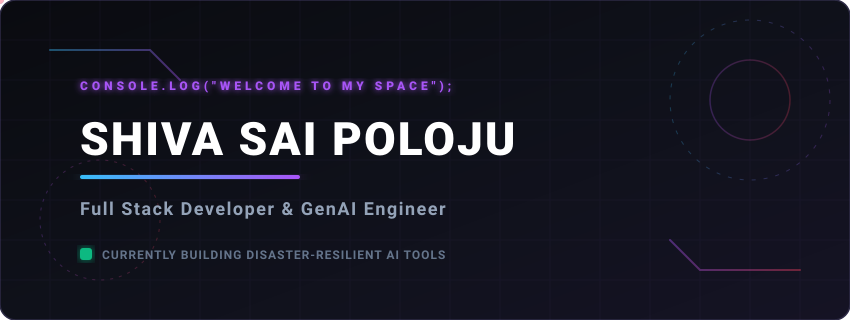

  <!-- Custom Neon Cyberpunk Header Banner -->
  
  
    
  
  <!-- Typing Animation -->
  
  
   

  <!-- Quick Social Badges -->
  
  
  
  

---

### 🌌 About Me

Hello! I'm **Shiva Sai Poloju**, a passionate **Full Stack Developer** and **Generative AI Engineer**. I specialize in engineering high-performance web applications and resilient AI systems. 

* 🔭 **Currently Building**: Advanced AI interfaces and disaster-resilient systems.
* 🧠 **Exploring**: Retrieval-Augmented Generation (RAG), Prompt Engineering, and custom neural agents.
* 💬 **Ask me about**: React, Node.js, FastAPI, Vector Databases, and AI Chatbots.
* ⚡ **Fun Fact**: I love combining UI/UX principles (like dark mode glassmorphism) with backend engineering.

---

### 🛠️ Technical Stack & Skills

Here is a curated directory of technologies I work with, represented by their official logos:

#### 💻 Languages

  
  
  
  
  

#### 🎨 Frontend Development

  
  
  
  
  
  

#### ⚙️ Backend Development & APIs

  
  
  
  
  

#### 🗄️ Databases

  
  
  

#### 🧠 AI & Machine Learning

  
  
  
  
  
  
  

#### 🛠️ Tools & Platforms

  
  
  
  
  
  
  

#### 📚 Core Concepts

  
  
  
  
  

---

### 🚀 Highlighted Project

#### 🚑 [LifeLine AI — Disaster-Resilient Medical Assistant](https://github.com/shivapoloju/LifeLine-AI)
> An offline-first, disaster-resilient medical assistant powered by Generative AI and RAG to provide medical diagnostic routing when communication infrastructure fails.
- ⚡ **Offline-First Resilience**: Local caching and lightweight database models for zero-connectivity environments.
- 🧠 **AI Diagnostics & RAG**: Contextual search using Retrieval-Augmented Generation for accurate symptom matching.
- ⚙️ **Tech Stack**: FastAPI, Google Gemini API, MongoDB, React, Tailwind CSS.

---

### 📊 GitHub Analytics

These live metrics show my coding activity, language distributions, and commit streaks:

  
  

  

---

### 📬 Connect With Me

Let's collaborate on AI integrations, web architectures, or open-source projects:

* **Portfolio Website**: [portfolio-beta-gray-51.vercel.app](https://portfolio-beta-gray-51.vercel.app/)
* **LinkedIn**: [linkedin.com/in/shivasaipoloju](https://www.linkedin.com/in/shivasaipoloju/)
* **Email**: [shivasaipoloju5@gmail.com](mailto:shivasaipoloju5@gmail.com)
* **WhatsApp / Call**: [+91 72070 62605](https://wa.me/917207062605)

 

  Designed with ❤️ by Shiva Sai Poloju • Built using Markdown, SVG &amp; Shields.io

